# The StatQuest Illustrated Guide to Machine Learning — Comprehensive Technical Notes

## Table of Contents

- [Chapter 01: Fundamental Concepts in Machine Learning!!!](#chapter-01)
  - [1.1 What is Machine Learning?](#chapter-01-1)
  - [1.2 Classification vs. Regression](#chapter-01-2)
  - [1.3 Classification Trees: A First Example](#chapter-01-3)
  - [1.4 Quantitative Predictions and Linear Regression](#chapter-01-4)
  - [1.5 Choosing Between Methods](#chapter-01-5)
  - [1.6 Training Data, Testing Data, and Overfitting](#chapter-01-6)
  - [1.7 Terminology: Variables, Features, Dependent/Independent](#chapter-01-7)
  - [1.8 Discrete vs. Continuous Data](#chapter-01-8)
- [Chapter 02: Cross Validation!!!](#chapter-02)
  - [2.1 The Problem: Which Points for Training vs. Testing?](#chapter-02-1)
  - [2.2 The Solution: Cross Validation](#chapter-02-2)
  - [2.3 How Cross Validation Works Step-by-Step](#chapter-02-3)
  - [2.4 10-Fold Cross Validation](#chapter-02-4)
  - [2.5 Leave-One-Out Cross Validation](#chapter-02-5)
  - [2.6 Comparing Models with Cross Validation](#chapter-02-6)
- [Chapter 03: Fundamental Concepts in Statistics!!!](#chapter-03)
  - [3.1 Why Statistics?](#chapter-03-1)
  - [3.2 Histograms](#chapter-03-2)
  - [3.3 Probability Distributions: Overview](#chapter-03-3)
  - [3.4 Discrete Probability Distributions: Binomial](#chapter-03-4)
  - [3.5 Discrete Probability Distributions: Poisson](#chapter-03-5)
  - [3.6 Continuous Probability Distributions: Normal (Gaussian)](#chapter-03-6)
  - [3.7 Exponential and Uniform Distributions](#chapter-03-7)
  - [3.8 Likelihood vs. Probability](#chapter-03-8)
  - [3.9 Models: Approximating Reality](#chapter-03-9)
  - [3.10 Sum of Squared Residuals (SSR)](#chapter-03-10)
  - [3.11 Mean Squared Error (MSE)](#chapter-03-11)
  - [3.12 R²: Coefficient of Determination](#chapter-03-12)
  - [3.13 p-values](#chapter-03-13)
- [Chapter 04: Linear Regression!!!](#chapter-04)
  - [4.1 The Problem: Fitting a Line](#chapter-04-1)
  - [4.2 Analytical Solution vs. Gradient Descent](#chapter-04-2)
  - [4.3 p-values for Linear Regression and R²](#chapter-04-3)
  - [4.4 Simple vs. Multiple Linear Regression](#chapter-04-4)
  - [4.5 Linear Models: Extensions](#chapter-04-5)
- [Chapter 05: Gradient Descent!!!](#chapter-05)
  - [5.1 Why Gradient Descent?](#chapter-05-1)
  - [5.2 The Gradient Descent Algorithm](#chapter-05-2)
  - [5.3 Optimizing a Single Parameter (Intercept)](#chapter-05-3)
  - [5.4 Optimizing Intercept and Slope Simultaneously](#chapter-05-4)
  - [5.5 Stochastic and Mini-Batch Gradient Descent](#chapter-05-5)
  - [5.6 Practical Considerations](#chapter-05-6)
- [Chapter 06: Logistic Regression!!!](#chapter-06)
  - [6.1 The Problem: Classification with Continuous Data](#chapter-06-1)
  - [6.2 The Logistic Squiggle](#chapter-06-2)
  - [6.3 Making Classifications](#chapter-06-3)
  - [6.4 Fitting the Squiggle: Maximum Likelihood](#chapter-06-4)
  - [6.5 Avoiding Underflow with Log-Likelihood](#chapter-06-5)
  - [6.6 Assumptions and Limitations](#chapter-06-6)
- [Chapter 07: Naive Bayes!!!](#chapter-07)
  - [7.1 The Problem: Spam Classification](#chapter-07-1)
  - [7.2 Multinomial Naive Bayes: Discrete Features](#chapter-07-2)
  - [7.3 Gaussian Naive Bayes: Continuous Features](#chapter-07-3)
  - [7.4 Handling Missing Data: Pseudocounts](#chapter-07-4)
  - [7.5 Frequently Asked Questions](#chapter-07-5)
- [Chapter 08: Assessing Model Performance!!!](#chapter-08)
  - [8.1 The Problem: Comparing Models](#chapter-08-1)
  - [8.2 Confusion Matrices](#chapter-08-2)
  - [8.3 Sensitivity and Specificity](#chapter-08-3)
  - [8.4 Precision and Recall](#chapter-08-4)
  - [8.5 True Positive Rate and False Positive Rate](#chapter-08-5)
  - [8.6 ROC Curves and AUC](#chapter-08-6)
  - [8.7 Precision-Recall Curves for Imbalanced Data](#chapter-08-7)
- [Chapter 09: Preventing Overfitting with Regularization!!!](#chapter-09)
  - [9.1 Overfitting, Bias, and Variance](#chapter-09-1)
  - [9.2 Ridge Regularization (L2)](#chapter-09-2)
  - [9.3 Lasso Regularization (L1)](#chapter-09-3)
  - [9.4 Ridge vs. Lasso: Key Differences](#chapter-09-4)
  - [9.5 Combining Ridge and Lasso](#chapter-09-5)
- [Chapter 10: Decision Trees!!!](#chapter-10)
  - [10.1 Types of Trees: Classification and Regression](#chapter-10-1)
  - [10.2 Classification Trees: Building the Tree](#chapter-10-2)
  - [10.3 Gini Impurity](#chapter-10-3)
  - [10.4 Handling Numeric Features](#chapter-10-4)
  - [10.5 Tree Growth, Pruning, and Minimum Leaf Size](#chapter-10-5)
  - [10.6 Summary: Building a Classification Tree](#chapter-10-6)

---

## Chapter 01: Fundamental Concepts in Machine Learning!!!

> **Executive Summary**  
> This chapter introduces the core ideas of machine learning: what it is, the two primary tasks (classification and regression), and the fundamental workflow of training, testing, and evaluating models. It also establishes key terminology used throughout the book.

### 1.1 What is Machine Learning?

**Machine Learning (ML)** is a collection of tools and techniques that transforms data into useful decisions.

- **Data** → **Decisions**
- Two broad categories of decisions:
  1. **Classification** – assigning discrete labels (e.g., “will like a movie” vs. “will not like a movie”).
  2. **Regression** – predicting quantitative values (e.g., predicting height from weight).

### 1.2 Classification vs. Regression

| Task | Output Type | Example |
|------|-------------|---------|
| Classification | Discrete class label | Will this person like *StatQuest*? Yes / No |
| Regression | Continuous numeric value | Predict height from weight |

### 1.3 Classification Trees: A First Example

**Problem:** Given a dataset about a person, classify whether they will like *StatQuest*.

**Solution:** Build a **Classification Tree** that asks a series of yes/no questions.

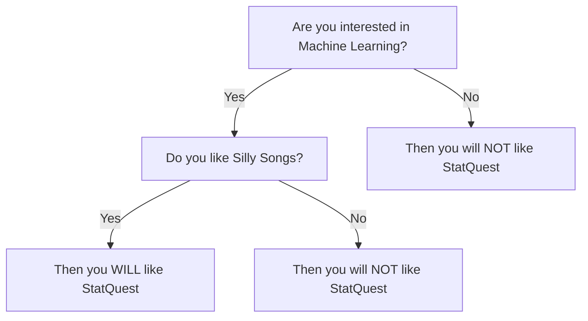
```mermaid
graph TD
    A[Are you interested in Machine Learning?] -->|Yes| B[Do you like Silly Songs?]
    A -->|No| C[Then you will NOT like StatQuest]
    B -->|Yes| D[Then you WILL like StatQuest]
    B -->|No| E[Then you will NOT like StatQuest]
```

### 1.4 Quantitative Predictions and Linear Regression

**Problem:** Predict a person’s height from their weight.

**Solution:** Use **Linear Regression** to fit a line through the data.

- The line summarizes the trend: as weight increases, height tends to increase.
- Once the line is fit, we can plug in a new weight to predict height.

> **BAM!** – The book’s signature exclamation for a key insight.

**Conceptual trend of Weight vs. Predicted Height:**

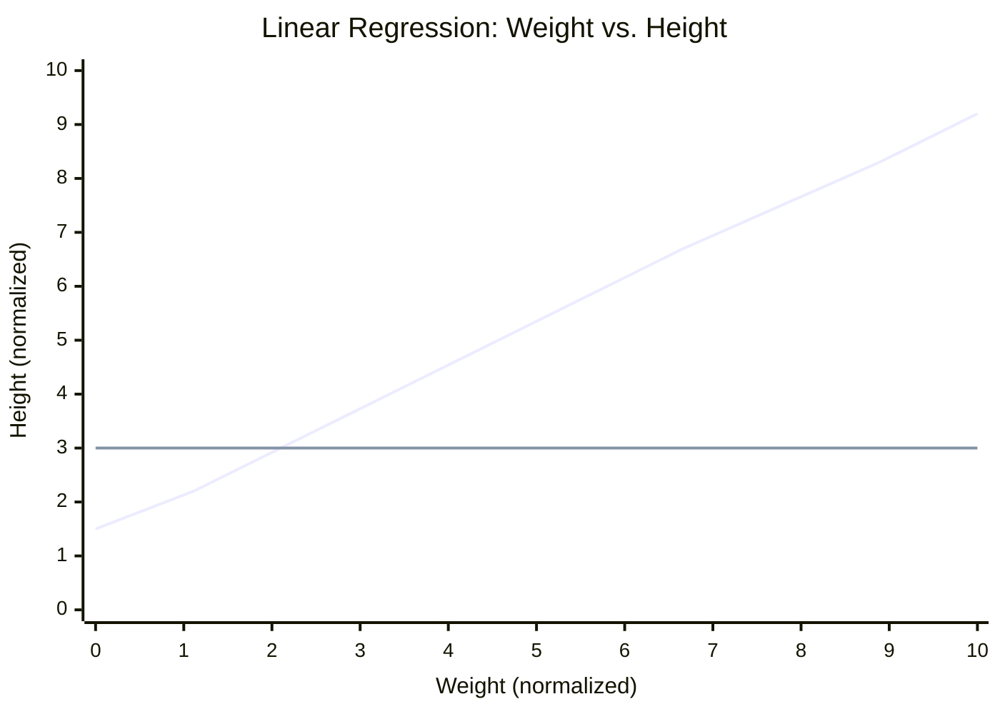
```mermaid
xychart-beta
    title "Linear Regression: Weight vs. Height"
    x-axis "Weight (normalized)" 0 --> 10
    y-axis "Height (normalized)" 0 --> 10
    line [1.5, 2.2, 3.1, 4.0, 4.9, 5.8, 6.7, 7.5, 8.3, 9.2]
    line [3, 3, 3, 3, 3, 3, 3, 3, 3, 3]
```

*(Blue line = fitted regression line; horizontal line = mean Height baseline.)*

### 1.5 Choosing Between Methods

- Many ML methods exist: Linear Regression, Logistic Regression, Naive Bayes, Decision Trees, SVMs, Neural Networks, etc.
- **How to choose?** Try different methods and compare their performance on **Testing Data**.
- The method with the lowest error on testing data is preferred.

### 1.6 Training Data, Testing Data, and Overfitting

| Term | Definition |
|------|------------|
| **Training Data** | Data used to fit (train) the model. |
| **Testing Data** | New, unseen data used to evaluate the model’s predictions. |
| **Overfitting** | When a model fits the training data very well but performs poorly on new data. |

> **Terminology Alert:** *Overfit* – a machine learning method fits the training data really well but makes poor predictions on new data.

**Example:**  
- A black line (simple model) may have higher training error but lower testing error.  
- A green squiggle (flexible model) may fit training data perfectly but fail on testing data.

**Error comparison between models:**

```mermaid
xychart-beta
    title "Training vs. Testing Error: Simple vs. Flexible Model"
    x-axis "Model Type" ["Black Line (Simple)", "Green Squiggle (Flexible)"]
    y-axis "Error (SSR)" 0 --> 10
    bar [4.5, 0.5]
    bar [3.1, 8.7]
```

*(First bar in each group = Training Error; second bar = Testing Error.)*

### 1.7 Terminology: Variables, Features, Dependent/Independent

| Term | Meaning | Example |
|------|---------|---------|
| **Variable** | Anything that can vary | Height, Weight |
| **Dependent Variable** | The variable we want to predict | Height |
| **Independent Variable** | The variable(s) used to predict | Weight |
| **Feature** | Another name for independent variable | Weight, Shoe Size, Favorite Color |

- Multiple features can be used to predict a single dependent variable.
- Features can be **numeric** (Weight) or **categorical** (Favorite Color).

**Example table with multiple features:**

| Weight | Shoe Size | Favorite Color | Height (target) |
|--------|-----------|----------------|-----------------|
| 0.4 | 3 | Blue | 1.1 |

### 1.8 Discrete vs. Continuous Data

| Data Type | Description | Example |
|-----------|-------------|---------|
| **Discrete** | Countable, specific values | Number of people who love green |
| **Continuous** | Measurable, any value in a range | Height (can be 181.73 cm) |

- Precision of continuous data is limited only by the measurement tool.

**Conceptual histogram of continuous Height measurements:**

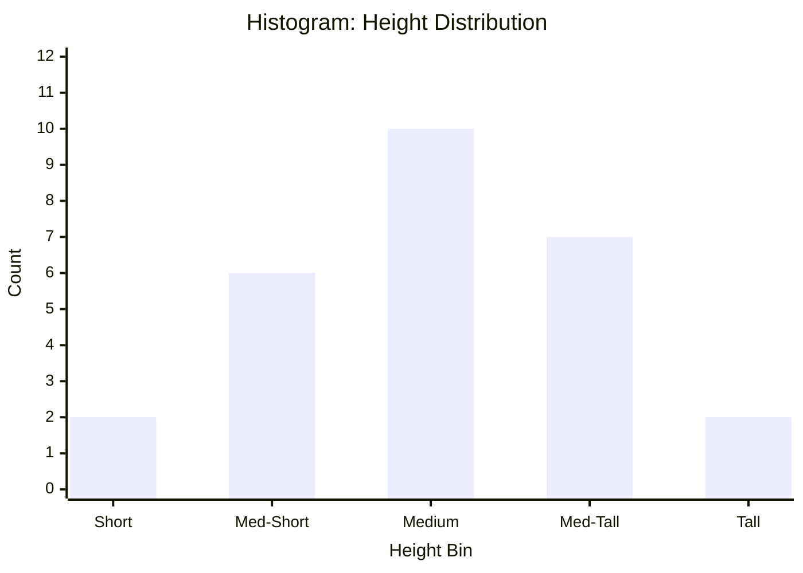
```mermaid
xychart-beta
    title "Histogram: Height Distribution"
    x-axis "Height Bin" ["Short", "Med-Short", "Medium", "Med-Tall", "Tall"]
    y-axis "Count" 0 --> 12
    bar [2, 6, 10, 7, 2]
```

---

## Chapter 02: Cross Validation!!!

> **Executive Summary**  
> Cross Validation is a resampling technique used to evaluate machine learning models when we don’t know which data points to use for training and testing. It iteratively uses all data for both training and testing, providing an unbiased estimate of model performance.

### 2.1 The Problem: Which Points for Training vs. Testing?

- We often have a dataset but no predefined training/testing split.
- Randomly selecting training/testing points can lead to **Data Leakage** or a biased evaluation.

### 2.2 The Solution: Cross Validation

- **Cross Validation** uses all data points for both training and testing in an iterative way.
- It avoids the need to guess which points are best for training or testing.

### 2.3 How Cross Validation Works Step-by-Step

1. **Randomly divide** the data into *k* groups (folds).
2. For each fold:
   - Use that fold as **Testing Data**.
   - Use the remaining *k−1* folds as **Training Data**.
3. Train the model and record the error on the testing fold.
4. Repeat until every fold has been used as testing data.
5. **Average** the errors to get an overall performance estimate.

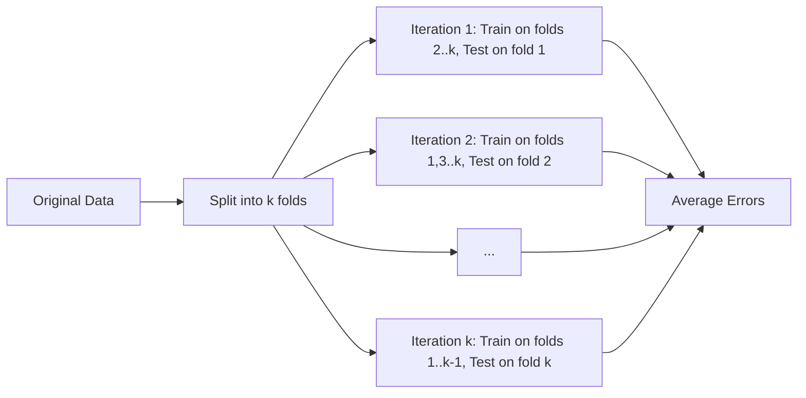
```mermaid
flowchart LR
    A[Original Data] --> B[Split into k folds]
    B --> C1[Iteration 1: Train on folds 2..k, Test on fold 1]
    B --> C2[Iteration 2: Train on folds 1,3..k, Test on fold 2]
    B --> C3[...]
    B --> Ck[Iteration k: Train on folds 1..k-1, Test on fold k]
    C1 --> D[Average Errors]
    C2 --> D
    C3 --> D
    Ck --> D
```

### 2.4 10-Fold Cross Validation

- Commonly used when data is plentiful.
- Data is randomized and divided into 10 equal-sized blocks.
- Train on 9 blocks, test on the 10th; repeat 10 times.

### 2.5 Leave-One-Out Cross Validation

- Uses all but one data point for training and the remaining point for testing.
- Iterates until every point has been used as testing data.
- Suitable for very small datasets.

### 2.6 Comparing Models with Cross Validation

- Cross Validation can compare different models (e.g., black line vs. green squiggle).
- Sometimes results are mixed; statistics (next chapter) help decide if differences are significant.

---

## Chapter 03: Fundamental Concepts in Statistics!!!

> **Executive Summary**  
> Statistics provides tools to quantify variation, make predictions, and assess confidence. This chapter covers histograms, probability distributions (Binomial, Poisson, Normal, Exponential, Uniform), likelihood vs. probability, and key metrics like SSR, MSE, R², and p-values.

### 3.1 Why Statistics?

- The world is variable (e.g., number of fries per order).
- Statistics helps quantify variation and make predictions with confidence.

**Example: Fry Diary**

| Day | Fries |
|-----|-------|
| Monday | 21 |
| Tuesday | 24 |
| Wednesday | 19 |
| Thursday | ??? |

Statistics predicts future values and quantifies confidence.

### 3.2 Histograms

- **Problem:** Many measurements overlap; hidden trends.
- **Solution:** Divide range into bins, stack measurements in each bin.
- **Probability estimate:** Count observations in a bin / total observations.

| Bin width | Effect |
|-----------|--------|
| Too wide | Loses detail |
| Too narrow | No clear trend |

**Conceptual histogram of Height measurements:**

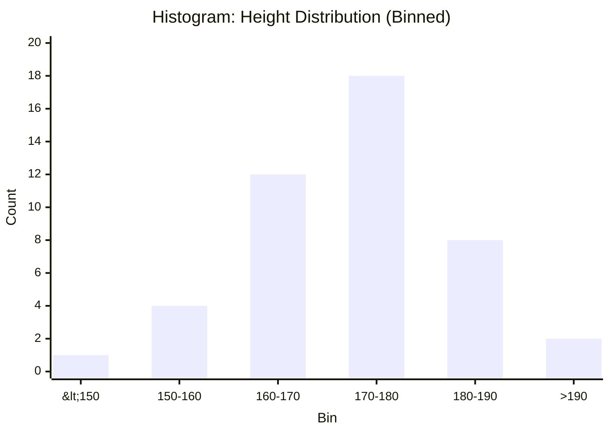
```mermaid
xychart-beta
    title "Histogram: Height Distribution (Binned)"
    x-axis "Bin" ["<150", "150-160", "160-170", "170-180", "180-190", ">190"]
    y-axis "Count" 0 --> 20
    bar [1, 4, 12, 18, 8, 2]
```

**Probability of falling into a bin:**

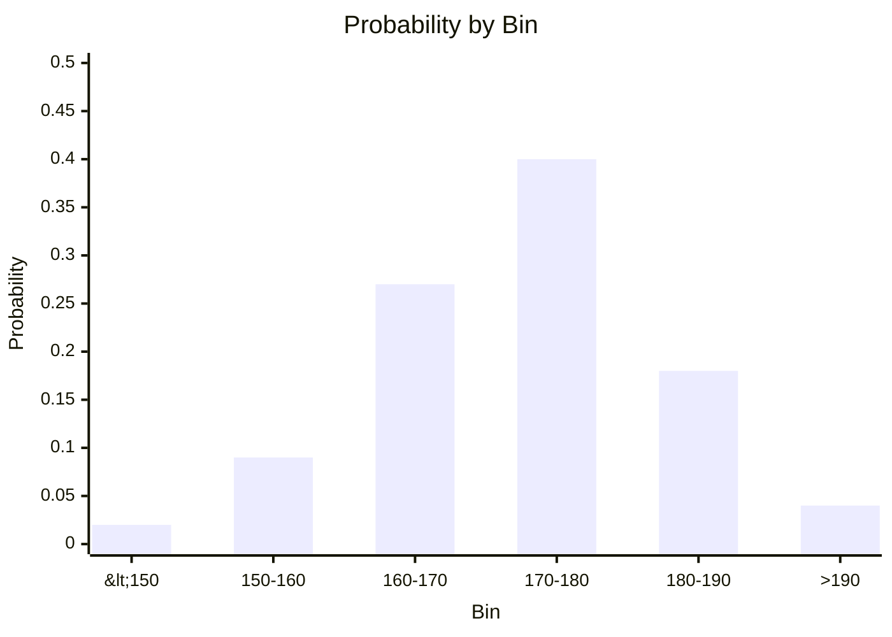
```mermaid
xychart-beta
    title "Probability by Bin"
    x-axis "Bin" ["<150", "150-160", "160-170", "170-180", "180-190", ">190"]
    y-axis "Probability" 0 --> 0.5
    bar [0.02, 0.09, 0.27, 0.40, 0.18, 0.04]
```

### 3.3 Probability Distributions: Overview

- Histograms require lots of data and have gaps.
- **Probability Distributions** use mathematical equations to approximate histograms.
- **Discrete distributions** for discrete data (Binomial, Poisson).
- **Continuous distributions** for continuous data (Normal, Exponential, Uniform).

### 3.4 Discrete Probability Distributions: Binomial

**Use case:** Binary outcomes (yes/no, win/loss).

**Formula:**

\[
p(x|n, p) = \binom{n}{x} p^x (1-p)^{n-x}
\]

where:
- \(n\) = number of trials
- \(x\) = number of successes
- \(p\) = probability of success on a single trial
- \(\binom{n}{x} = \frac{n!}{x!(n-x)!}\) = number of ways to arrange \(x\) successes.

**Example:** Probability that 2 out of 3 people prefer pumpkin pie, given \(p=0.7\).

\[
p(2|3, 0.7) = \binom{3}{2} (0.7)^2 (0.3)^1 = 3 \times 0.49 \times 0.3 = 0.441
\]

**Binomial distribution for n=3, p=0.7:**

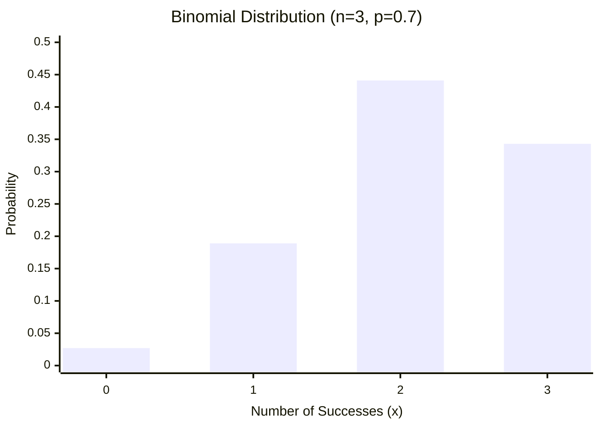
```mermaid
xychart-beta
    title "Binomial Distribution (n=3, p=0.7)"
    x-axis "Number of Successes (x)" [0, 1, 2, 3]
    y-axis "Probability" 0 --> 0.5
    bar [0.027, 0.189, 0.441, 0.343]
```

**Binomial distribution for n=10, p=0.5 (illustrating symmetry):**

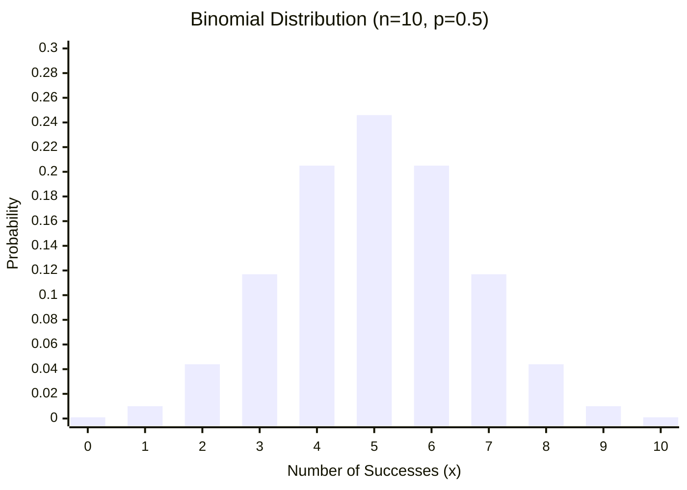
```mermaid
xychart-beta
    title "Binomial Distribution (n=10, p=0.5)"
    x-axis "Number of Successes (x)" [0, 1, 2, 3, 4, 5, 6, 7, 8, 9, 10]
    y-axis "Probability" 0 --> 0.3
    bar [0.001, 0.010, 0.044, 0.117, 0.205, 0.246, 0.205, 0.117, 0.044, 0.010, 0.001]
```

### 3.5 Discrete Probability Distributions: Poisson

**Use case:** Events in discrete units of time or space.

**Formula:**

\[
p(x|\lambda) = \frac{e^{-\lambda} \lambda^x}{x!}
\]

- \(\lambda\) = average number of events per unit.
- \(x\) = number of events we want the probability for.

**Example:** Probability of reading exactly 8 pages in an hour, given average 10 pages/hour.

\[
p(8|10) = \frac{e^{-10} 10^8}{8!} \approx 0.113
\]

**Poisson distribution for λ=10:**

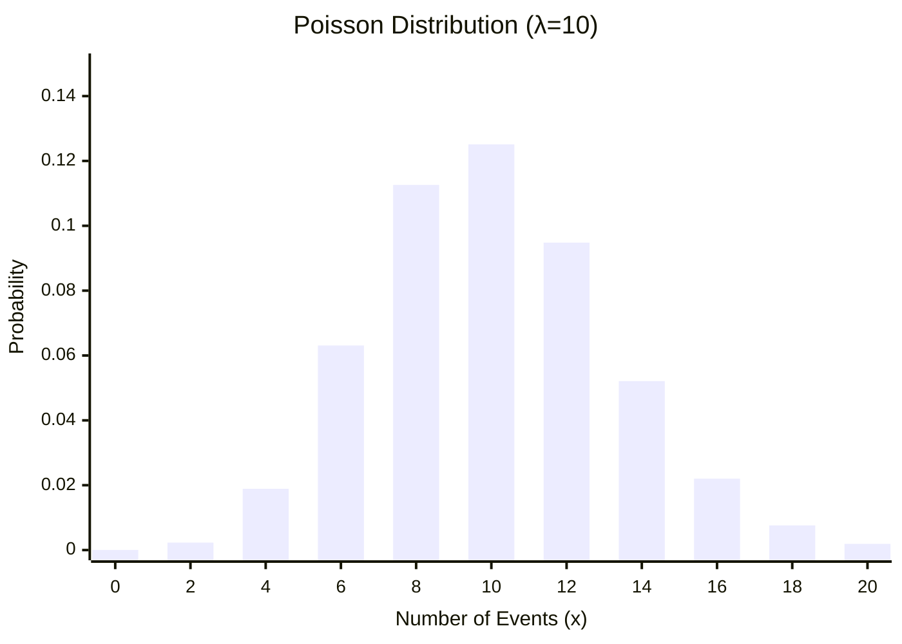
```mermaid
xychart-beta
    title "Poisson Distribution (λ=10)"
    x-axis "Number of Events (x)" [0, 2, 4, 6, 8, 10, 12, 14, 16, 18, 20]
    y-axis "Probability" 0 --> 0.15
    bar [0.00005, 0.0023, 0.0189, 0.0631, 0.1126, 0.1251, 0.0948, 0.0521, 0.0220, 0.0076, 0.0019]
```

### 3.6 Continuous Probability Distributions: Normal (Gaussian)

**Use case:** Many natural phenomena (heights, measurement errors).

**Formula:**

\[
f(x|\mu, \sigma) = \frac{1}{\sqrt{2\pi\sigma^2}} e^{-(x-\mu)^2 / (2\sigma^2)}
\]

- \(\mu\) = mean
- \(\sigma\) = standard deviation

**Key properties:**
- Bell-shaped curve.
- About 95% of measurements fall within \(\mu \pm 2\sigma\).
- Probability = area under the curve between two points.
- Likelihood = y-axis coordinate for a specific \(x\).

**Infant heights: μ = 50 cm, σ = 1.5 cm**

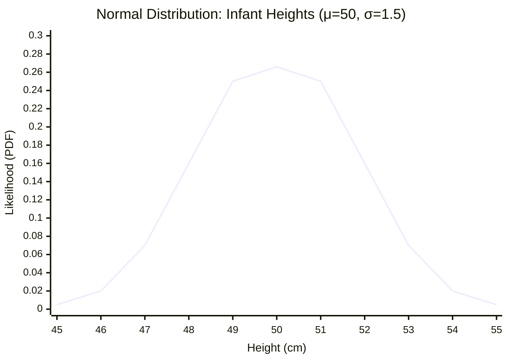
```mermaid
xychart-beta
    title "Normal Distribution: Infant Heights (μ=50, σ=1.5)"
    x-axis "Height (cm)" [45, 46, 47, 48, 49, 50, 51, 52, 53, 54, 55]
    y-axis "Likelihood (PDF)" 0 --> 0.30
    line [0.005, 0.020, 0.070, 0.160, 0.250, 0.266, 0.250, 0.160, 0.070, 0.020, 0.005]
```

**Adult heights: μ = 177 cm, σ = 10.2 cm**

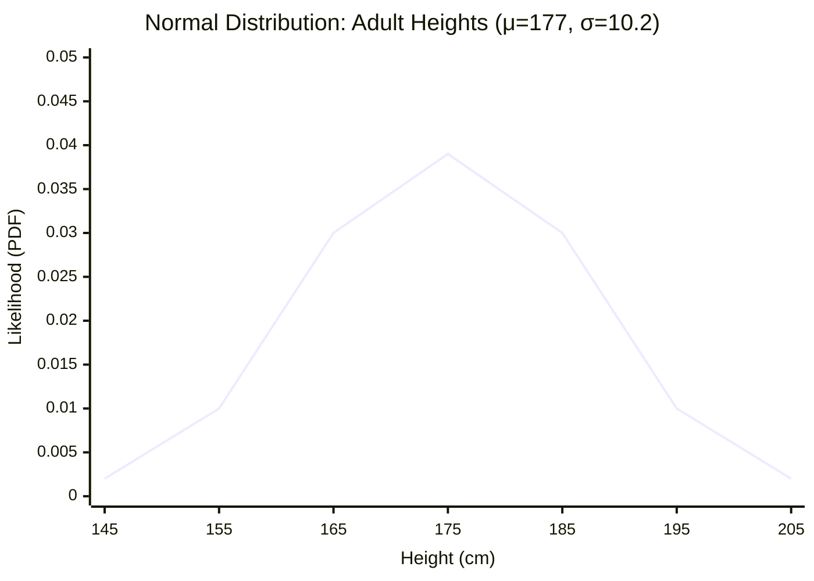
```mermaid
xychart-beta
    title "Normal Distribution: Adult Heights (μ=177, σ=10.2)"
    x-axis "Height (cm)" [145, 155, 165, 175, 185, 195, 205]
    y-axis "Likelihood (PDF)" 0 --> 0.05
    line [0.002, 0.010, 0.030, 0.039, 0.030, 0.010, 0.002]
```

> **NOTE:** The infant curve is tall and narrow (small σ); the adult curve is shorter and wider (larger σ).

### 3.7 Exponential and Uniform Distributions

| Distribution | Use Case | Parameters |
|--------------|----------|------------|
| **Exponential** | Time between events | Rate \(\lambda\) |
| **Uniform** | Equally likely random numbers | Min, Max |

- Exponential: decreasing curve, more likely for short intervals.
- Uniform: flat likelihood across range.

**Exponential Distribution (λ=0.5):**

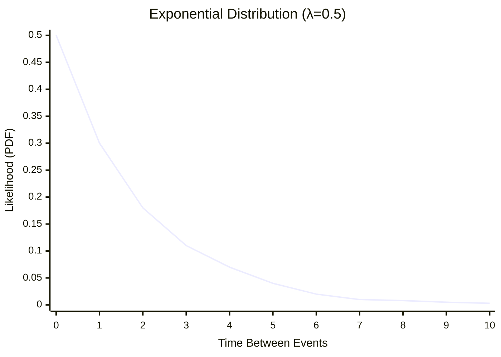
```mermaid
xychart-beta
    title "Exponential Distribution (λ=0.5)"
    x-axis "Time Between Events" 0 --> 10
    y-axis "Likelihood (PDF)" 0 --> 0.5
    line [0.50, 0.30, 0.18, 0.11, 0.07, 0.04, 0.02, 0.01, 0.008, 0.005, 0.003]
```

**Uniform 0–1 vs. Uniform 0–5:**

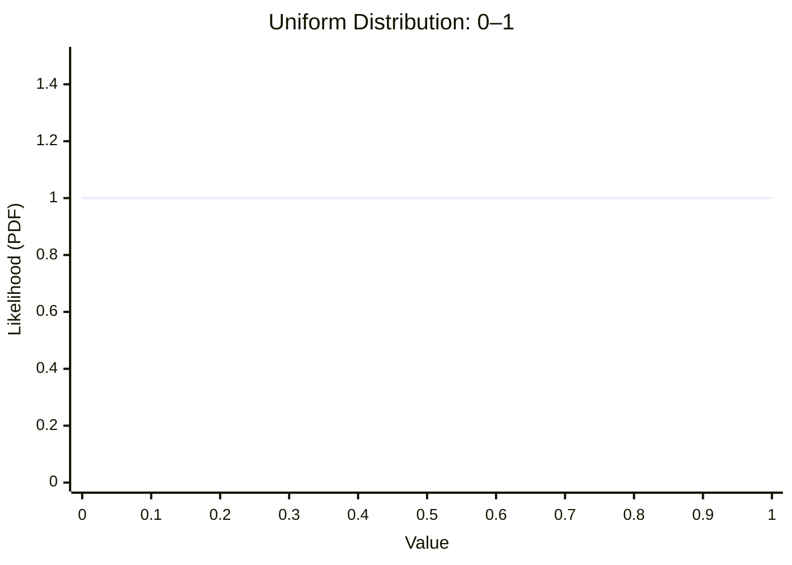
```mermaid
xychart-beta
    title "Uniform Distribution: 0–1"
    x-axis "Value" 0 --> 1
    y-axis "Likelihood (PDF)" 0 --> 1.5
    line [1.0, 1.0, 1.0, 1.0, 1.0, 1.0, 1.0, 1.0, 1.0, 1.0, 1.0]
```

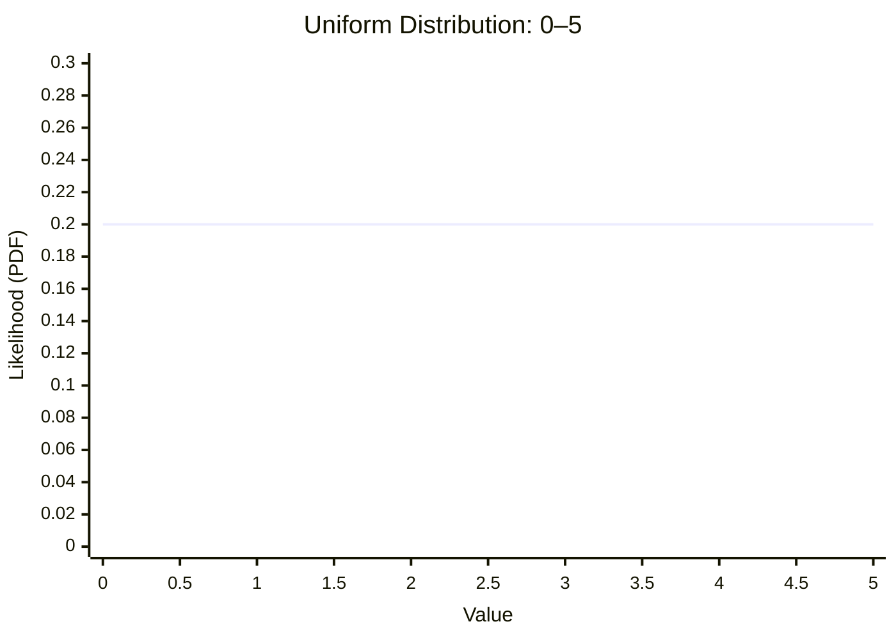
```mermaid
xychart-beta
    title "Uniform Distribution: 0–5"
    x-axis "Value" 0 --> 5
    y-axis "Likelihood (PDF)" 0 --> 0.3
    line [0.2, 0.2, 0.2, 0.2, 0.2, 0.2, 0.2, 0.2, 0.2, 0.2, 0.2]
```

### 3.8 Likelihood vs. Probability

| Concept | Definition |
|---------|------------|
| **Probability** | Area under the curve between two points. |
| **Likelihood** | Y-axis coordinate for a specific point. |

- For continuous distributions, probability of a single point is 0.
- Likelihood is used to fit distributions to data.

### 3.9 Models: Approximating Reality

- **Model:** A mathematical approximation of reality.
- **Probability Distribution** is a model.
- **Linear Regression** is a model.
- Models are trained on **Training Data** and evaluated on **Testing Data**.

### 3.10 Sum of Squared Residuals (SSR)

- **Residual** = Observed − Predicted.
- **SSR** = \(\sum (Observed_i - Predicted_i)^2\).

**Why square?** To prevent positive and negative residuals from canceling out.

**Example calculation (3 data points):**

| i | Observed | Predicted | Residual | Squared |
|---|----------|-----------|----------|---------|
| 1 | 1.9 | 1.7 | 0.2 | 0.04 |
| 2 | 1.6 | 2.0 | −0.4 | 0.16 |
| 3 | 2.9 | 2.2 | 0.7 | 0.49 |
| | | | **SSR** | **0.69** |

### 3.11 Mean Squared Error (MSE)

\[
MSE = \frac{SSR}{n}
\]

- Average of squared residuals.
- Easier to compare across datasets of different sizes.

**Example:**  
- Dataset 1: SSR = 14, n = 3 → MSE = 4.7  
- Dataset 2: SSR = 22, n = 5 → MSE = 4.4

**MSE comparison across datasets:**

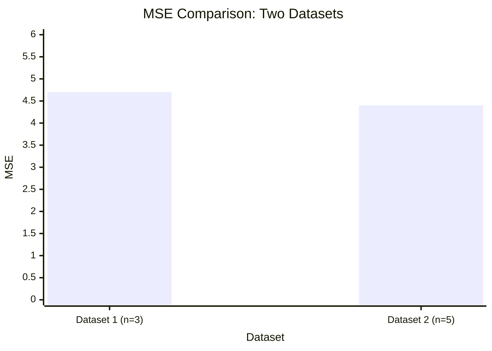
```mermaid
xychart-beta
    title "MSE Comparison: Two Datasets"
    x-axis "Dataset" ["Dataset 1 (n=3)", "Dataset 2 (n=5)"]
    y-axis "MSE" 0 --> 6
    bar [4.7, 4.4]
```

### 3.12 R²: Coefficient of Determination

\[
R^2 = \frac{SSR(mean) - SSR(fitted\ line)}{SSR(mean)}
\]

- Range: 0 to 1 (for simple linear regression).
- Proportion of variance explained by the model.
- \(R^2 = 1\) means perfect fit.
- \(R^2 = 0\) means model is no better than the mean.

> **NOTE:** For non-linear models, \(R^2\) can be negative.

**Example:**  
- SSR(mean) = 1.6  
- SSR(fitted line) = 0.5  
- \(R^2 = (1.6 - 0.5) / 1.6 = 0.7\) (70% reduction in residuals)

**Visual: SSR(mean) vs. SSR(fitted line):**

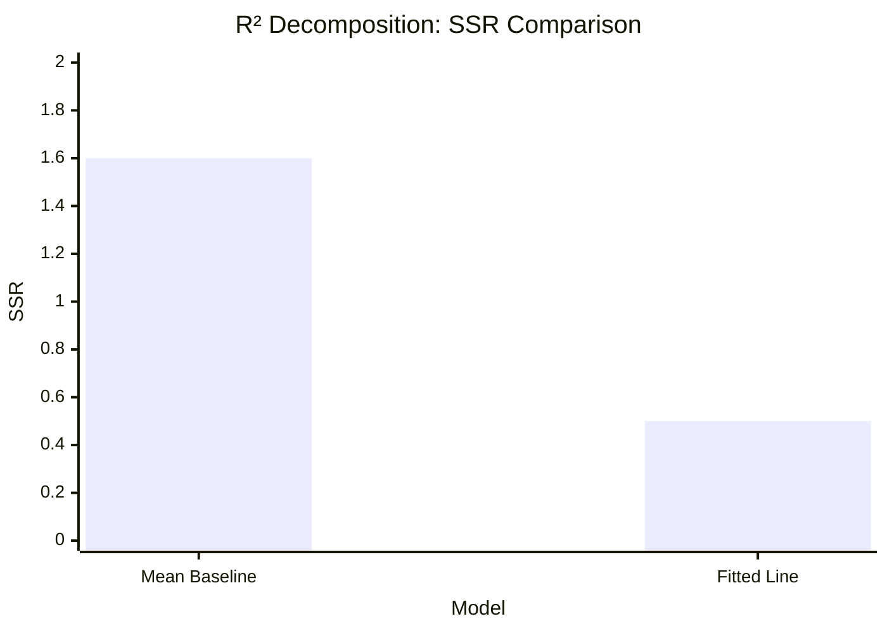
```mermaid
xychart-beta
    title "R² Decomposition: SSR Comparison"
    x-axis "Model" ["Mean Baseline", "Fitted Line"]
    y-axis "SSR" 0 --> 2.0
    bar [1.6, 0.5]
```

**R² curve for different SSR(fitted) values (SSR(mean)=1.6):**

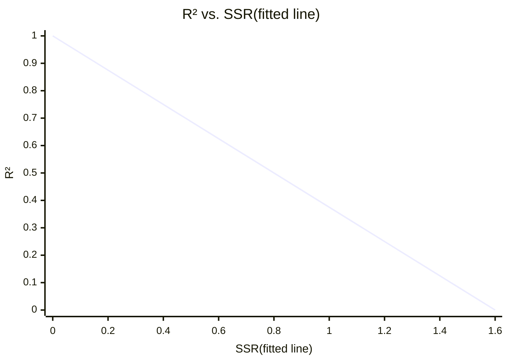
```mermaid
xychart-beta
    title "R² vs. SSR(fitted line)"
    x-axis "SSR(fitted line)" 0 --> 1.6
    y-axis "R²" 0 --> 1
    line [1.0, 0.9, 0.8, 0.7, 0.6, 0.5, 0.4, 0.3, 0.2, 0.1, 0.0]
```

### 3.13 p-values

- **p-value:** Probability of observing results as extreme as those obtained, assuming the null hypothesis is true.
- **Null Hypothesis:** No difference between groups.
- **Threshold:** Commonly 0.05.
- Small p-value → reject null hypothesis → statistically significant difference.

**False Positive:** Getting a small p-value when there is no true difference.

**p-value distribution under the null hypothesis:**

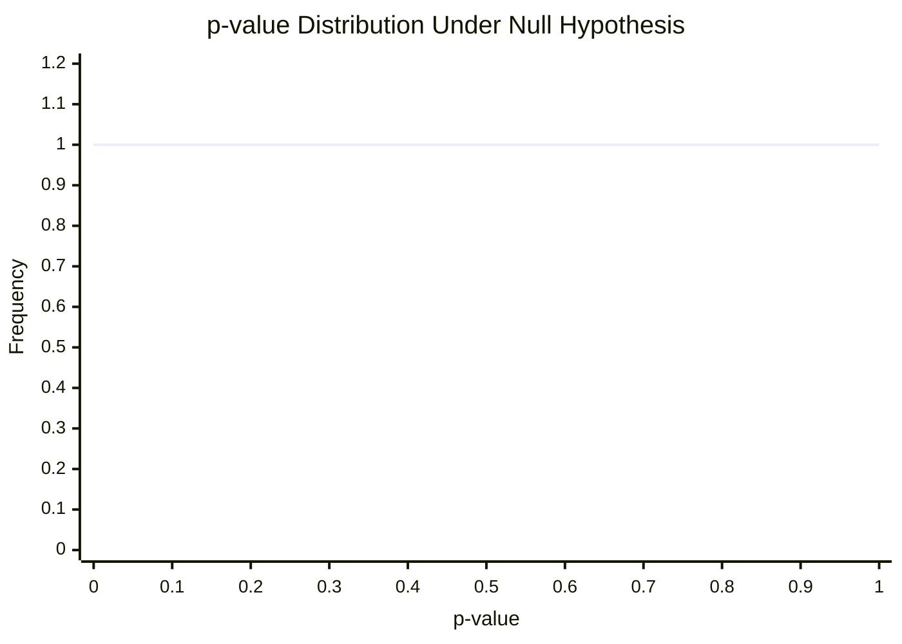
```mermaid
xychart-beta
    title "p-value Distribution Under Null Hypothesis"
    x-axis "p-value" 0 --> 1
    y-axis "Frequency" 0 --> 1.2
    line [1.0, 1.0, 1.0, 1.0, 1.0, 1.0, 1.0, 1.0, 1.0, 1.0, 1.0]
```

*(Under the null, p-values are uniformly distributed. 5% of experiments will yield p < 0.05 by chance alone.)*

---

## Chapter 04: Linear Regression!!!

> **Executive Summary**  
> Linear Regression fits a straight line to data to predict a continuous outcome. It minimizes the Sum of Squared Residuals (SSR) and provides R² and p-values for model evaluation.

### 4.1 The Problem: Fitting a Line

- Given data (Weight, Height), find the line that best predicts Height from Weight.
- **Objective:** Minimize SSR.

### 4.2 Analytical Solution vs. Gradient Descent

| Method | Description |
|--------|-------------|
| **Analytical Solution** | Direct formula gives optimal parameters. |
| **Gradient Descent** | Iterative optimization; used when no analytical solution exists. |

**SSR vs. Intercept (parabola — conceptual):**

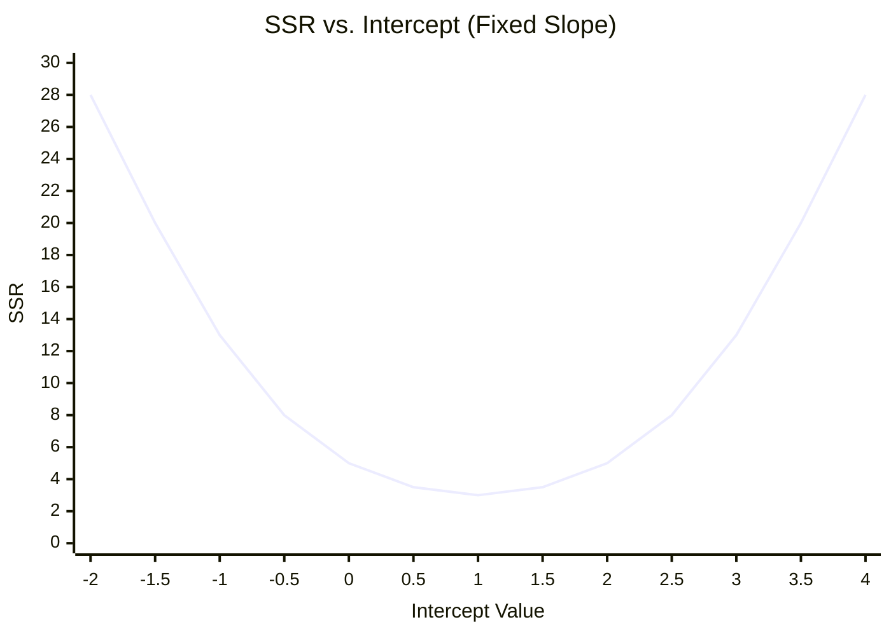
```mermaid
xychart-beta
    title "SSR vs. Intercept (Fixed Slope)"
    x-axis "Intercept Value" -2 --> 4
    y-axis "SSR" 0 --> 30
    line [28, 20, 13, 8, 5, 3.5, 3, 3.5, 5, 8, 13, 20, 28]
```

**SSR vs. Slope (parabola — conceptual):**

```mermaid
xychart-beta
    title "SSR vs. Slope (Fixed Intercept)"
    x-axis "Slope Value" -2 --> 2
    y-axis "SSR" 0 --> 25
    line [22, 16, 10, 6, 3.5, 2.5, 2.5, 3.5, 6, 10, 16, 22]
```

### 4.3 p-values for Linear Regression and R²

- Linear Regression provides a **p-value** for the fitted line.
- Tests whether the slope is significantly different from 0.
- A low p-value indicates the model’s predictions are better than using the mean.

**Example:**  
- \(R^2 = 0.66\)  
- \(p\text{-value} = 0.1\)  
- Interpretation: 10% chance random data could give \(R^2 \ge 0.66\) → relatively high p-value → less confidence.

### 4.4 Simple vs. Multiple Linear Regression

| Type | Predictors | Visualization |
|------|------------|---------------|
| Simple | 1 | 2D line |
| Multiple | 2+ | Plane (2 predictors) or hyperplane |

**Example:**  
Height = 1.1 + 0.5 × Weight + 0.3 × Shoe Size

**Predicted Height vs. Weight (with fixed Shoe Size):**

```mermaid
xychart-beta
    title "Multiple Linear Regression: Weight vs. Height"
    x-axis "Weight (normalized)" 0 --> 10
    y-axis "Predicted Height (normalized)" 0 --> 10
    line [1.1, 2.1, 3.1, 4.1, 5.1, 6.1, 7.1, 8.1, 9.1, 10.1]
```

### 4.5 Linear Models: Extensions

- **Linear Models** can handle discrete predictors (e.g., “Loves Troll 2” as 0/1).
- Can combine discrete and continuous predictors.
- Provide R² and p-values just like simple linear regression.

**Example: Predicting Popcorn Consumption from Troll 2 preference and Soda Pop consumption**

| Loves Troll 2 | Soda Pop (ml) | Popcorn (g) |
|---------------|---------------|-------------|
| Yes (1) | 750.7 | 24.3 |
| Yes (1) | 533.2 | 28.2 |
| No (0) | 120.5 | 2.1 |
| No (0) | 110.9 | 4.8 |

- \(R^2 = 0.97\), \(p\text{-value} = 0.006\) → strong model.

---

## Chapter 05: Gradient Descent!!!

> **Executive Summary**  
> Gradient Descent is an iterative optimization algorithm used to minimize a loss/cost function. It is essential for models without analytical solutions, such as Logistic Regression and Neural Networks.

### 5.1 Why Gradient Descent?

- Many models (Logistic Regression, Neural Networks) have no analytical solution.
- Gradient Descent can optimize parameters for a wide variety of models.

### 5.2 The Gradient Descent Algorithm

1. **Initialize** parameters with random values.
2. **Compute** the derivative of the loss function with respect to each parameter.
3. **Update** each parameter:  
   \(New = Current - Learning\ Rate \times Derivative\)
4. **Repeat** until step size is small or maximum iterations reached.

```mermaid
flowchart TD
    A[Initialize Parameters Randomly] --> B[Compute Derivative of Loss]
    B --> C[Calculate Step Size = Derivative × Learning Rate]
    C --> D[Update Parameter = Current − Step Size]
    D --> E{Step Size ≈ 0 or Max Iterations?}
    E -->|No| B
    E -->|Yes| F[Return Optimized Parameters]
```

### 5.3 Optimizing a Single Parameter (Intercept)

- Example: Fit a line with fixed slope (0.64) and optimize the intercept.
- Loss function: SSR.
- Derivative: \(\frac{dSSR}{d\,intercept} = -2 \sum (Height - (intercept + slope \times Weight))\)
- Update rule: \(intercept_{new} = intercept_{current} - \alpha \times \frac{dSSR}{d\,intercept}\)

**Gradient Descent convergence: Intercept vs. Iteration**

```mermaid
xychart-beta
    title "Gradient Descent: Intercept Convergence"
    x-axis "Iteration" 0 --> 7
    y-axis "Intercept Value" 0 --> 1.1
    line [0.00, 0.57, 0.80, 0.88, 0.92, 0.94, 0.95, 0.95]
```

**Gradient Descent convergence: SSR vs. Iteration**

```mermaid
xychart-beta
    title "Gradient Descent: SSR Convergence"
    x-axis "Iteration" 0 --> 7
    y-axis "SSR" 0 --> 4
    line [3.1, 1.4, 0.8, 0.5, 0.35, 0.28, 0.25, 0.25]
```

**Step Size vs. Iteration (decaying steps):**

```mermaid
xychart-beta
    title "Gradient Descent: Step Size Decay"
    x-axis "Iteration" 0 --> 7
    y-axis "Step Size" 0 --> 0.7
    line [0.57, 0.23, 0.08, 0.04, 0.02, 0.01, 0.005, 0.002]
```

### 5.4 Optimizing Intercept and Slope Simultaneously

- Now optimize both parameters.
- Derivatives:

\[
\frac{\partial SSR}{\partial intercept} = -2 \sum (Height - (intercept + slope \times Weight))
\]

\[
\frac{\partial SSR}{\partial slope} = -2 \sum Weight \times (Height - (intercept + slope \times Weight))
\]

- Update both simultaneously.
- After ~475 iterations, converge to optimal values: intercept = 0.95, slope = 0.64.

**3D SSR surface (conceptual — two parameters):**

```mermaid
xychart-beta
    title "SSR Surface: Intercept vs. Slope (cross-section)"
    x-axis "Slope" -1 --> 2
    y-axis "SSR" 0 --> 20
    line [15, 10, 6, 3.5, 2.5, 2.5, 3.5, 6, 10, 15, 20]
```

### 5.5 Stochastic and Mini-Batch Gradient Descent

| Variant | Description | Advantage |
|---------|-------------|-----------|
| Batch GD | Uses all data per iteration | Stable but slow |
| Stochastic GD | Uses 1 random point per iteration | Fast, can escape local minima |
| Mini-Batch GD | Uses a small subset | Balance of speed and stability |

**Convergence comparison (conceptual):**

```mermaid
xychart-beta
    title "Convergence Speed: Batch vs. Stochastic GD"
    x-axis "Iteration" 0 --> 10
    y-axis "Loss" 0 --> 10
    line [10, 7, 5, 3.5, 2.5, 1.8, 1.3, 1.0, 0.8, 0.6, 0.5]
    line [10, 4, 2, 1.2, 0.8, 0.6, 0.5, 0.45, 0.42, 0.4, 0.39]
```

*(Blue = Batch GD; Green = Stochastic GD — faster initial descent but noisier.)*

### 5.6 Practical Considerations

- **Learning Rate:** Small → slow convergence; large → overshoot.
- **Local Minima:** Use multiple random starts or Stochastic GD.
- **Convergence:** Stop when step size is near 0 or max iterations reached.

**Effect of Learning Rate on Convergence:**

```mermaid
xychart-beta
    title "Learning Rate Effect on Convergence"
    x-axis "Iteration" 0 --> 10
    y-axis "Loss" 0 --> 10
    line [10, 6, 3.5, 2, 1.2, 0.8, 0.5, 0.3, 0.2, 0.15, 0.1]
    line [10, 9, 8.5, 8.2, 8.1, 8.05, 8.02, 8.01, 8.005, 8.002, 8.001]
    line [10, 12, 15, 20, 28, 40, 55, 75, 100, 130, 170]
```

*(Green = Small LR (slow); Blue = Optimal LR; Red = Large LR (diverges).)*

---

## Chapter 06: Logistic Regression!!!

> **Executive Summary**  
> Logistic Regression is used for classification. It fits an S-shaped squiggle to data, predicting probabilities between 0 and 1. It is optimized using Maximum Likelihood and Gradient Descent.

### 6.1 The Problem: Classification with Continuous Data

- **Linear Regression** predicts continuous values.
- **Classification** needs discrete labels (e.g., Loves Troll 2: Yes/No).
- Need a model that outputs probabilities.

### 6.2 The Logistic Squiggle

- Logistic Regression fits an **S-shaped curve** (sigmoid).
- Y-axis = probability (0 to 1).
- As x increases, probability approaches 1; as x decreases, probability approaches 0.

**Sigmoid curve (Popcorn vs. Probability of Loving Troll 2):**

```mermaid
xychart-beta
    title "Logistic Regression: Popcorn vs. Probability"
    x-axis "Popcorn (g)" 0 --> 100
    y-axis "Probability of Loving Troll 2" 0 --> 1
    line [0.02, 0.05, 0.10, 0.20, 0.35, 0.55, 0.75, 0.90, 0.96, 0.99, 0.995]
```

**Sigmoid curve with classification threshold (0.5):**

```mermaid
xychart-beta
    title "Logistic Regression with Threshold = 0.5"
    x-axis "Popcorn (g)" 0 --> 100
    y-axis "Probability" 0 --> 1
    line [0.02, 0.05, 0.10, 0.20, 0.35, 0.55, 0.75, 0.90, 0.96, 0.99, 0.995]
    line [0.5, 0.5, 0.5, 0.5, 0.5, 0.5, 0.5, 0.5, 0.5, 0.5, 0.5]
```

### 6.3 Making Classifications

- **Threshold:** Commonly 0.5.
- If predicted probability > 0.5 → classify as positive.
- If predicted probability ≤ 0.5 → classify as negative.

**Threshold effects on classification:**

| Threshold | Person with P=0.96 | Person with P=0.27 |
|-----------|-------------------|-------------------|
| 0.5 | Loves Troll 2 | Does Not Love Troll 2 |
| 0.01 | Loves Troll 2 | Loves Troll 2 (False Positive) |
| 0.95 | Loves Troll 2 | Does Not Love Troll 2 |

### 6.4 Fitting the Squiggle: Maximum Likelihood

- **Likelihood:** Y-axis coordinate for each data point on the squiggle.
- **Total Likelihood:** Product of individual likelihoods.
- **Goal:** Find the squiggle that maximizes the total likelihood.
- **Optimization:** Use Gradient Descent.

**Likelihood calculation example:**

| Data Point | Popcorn (g) | Loves Troll 2? | Likelihood |
|------------|-------------|----------------|------------|
| 1 | 10 | Yes | 0.4 |
| 2 | 20 | Yes | 0.6 |
| 3 | 30 | Yes | 0.8 |
| 4 | 40 | Yes | 0.9 |
| 5 | 50 | Yes | 0.9 |
| 6 | 60 | Yes | 0.9 |
| 7 | 70 | Yes | 0.9 |
| 8 | 80 | No | 0.2 |
| 9 | 90 | No | 0.1 |

**Total Likelihood** = 0.4 × 0.6 × 0.8 × 0.9 × 0.9 × 0.9 × 0.9 × 0.2 × 0.1 = **0.02**

**Comparing two squiggles:**

| Squiggle | Total Likelihood |
|----------|-----------------|
| Purple (better fit) | 0.02 |
| Light Purple (worse fit) | 0.004 |

### 6.5 Avoiding Underflow with Log-Likelihood

- Multiplying many small probabilities can cause **Underflow** (too small for computer).
- **Solution:** Take the log of the likelihoods and add them.
- Maximizing log-likelihood is equivalent to maximizing likelihood.

**Log-Likelihood example:**

\[
\log(0.4) + \log(0.6) + \log(0.8) + \log(0.9) + \log(0.9) + \log(0.9) + \log(0.9) + \log(0.2) + \log(0.1) = -4.0
\]

| Metric | Value |
|--------|-------|
| Likelihood | 0.02 |
| Log-Likelihood | −4.0 |

### 6.6 Assumptions and Limitations

- Assumes an S-shaped relationship between predictors and outcome.
- If the relationship is more complex, use Decision Trees, SVMs, or Neural Networks.

---

## Chapter 07: Naive Bayes!!!

> **Executive Summary**  
> Naive Bayes is a simple yet effective classification algorithm based on Bayes’ theorem. It assumes independence between features and is particularly useful for text classification (spam filtering).

### 7.1 The Problem: Spam Classification

- Classify messages as **Normal** or **Spam**.
- Need a model that uses word frequencies.

### 7.2 Multinomial Naive Bayes: Discrete Features

**Steps:**
1. Build histograms of words for each class.
2. Calculate **Prior Probabilities**: P(Normal), P(Spam).
3. Calculate **Conditional Probabilities**: P(word | class).
4. For a new message, compute:

\[
Score(Normal) = P(Normal) \times \prod P(word_i | Normal)
\]

\[
Score(Spam) = P(Spam) \times \prod P(word_i | Spam)
\]

5. Classify as the class with the higher score.

**Word histograms for Normal vs. Spam:**

```mermaid
xychart-beta
    title "Word Frequencies: Normal Messages"
    x-axis "Word" ["Dear", "Friend", "Lunch", "Money"]
    y-axis "Count" 0 --> 10
    bar [8, 5, 3, 1]
```

```mermaid
xychart-beta
    title "Word Frequencies: Spam Messages"
    x-axis "Word" ["Dear", "Friend", "Lunch", "Money"]
    y-axis "Count" 0 --> 5
    bar [2, 1, 0, 4]
```

**Probability of word given class:**

| Word | P(word\|Normal) | P(word\|Spam) |
|------|-----------------|---------------|
| Dear | 0.47 | 0.29 |
| Friend | 0.29 | 0.14 |
| Lunch | 0.18 | 0.00 |
| Money | 0.06 | 0.57 |

**Prior Probabilities:**

| Class | Probability |
|-------|-------------|
| Normal | 0.67 |
| Spam | 0.33 |

**Example:** Message: “Dear Friend”

- Score(Normal) = 0.67 × 0.47 × 0.29 = **0.09**
- Score(Spam) = 0.33 × 0.29 × 0.14 = **0.01**
- **Classification: Normal**

### 7.3 Gaussian Naive Bayes: Continuous Features

- For continuous features, assume each feature follows a **Gaussian (Normal) distribution** within each class.
- Calculate mean and standard deviation for each feature per class.
- Use Gaussian probability density function to compute likelihoods.

**Example: Popcorn consumption for Troll 2 lovers vs. non-lovers**

| Feature | Mean (No Love) | SD (No Love) | Mean (Love) | SD (Love) |
|---------|----------------|--------------|-------------|-----------|
| Popcorn | 4 | 2 | 24 | 4 |
| Soda Pop | 220 | 100 | 500 | 100 |
| Candy | 25 | 5 | 100 | 20 |

**Gaussian curves for Popcorn:**

```mermaid
xychart-beta
    title "Popcorn Distribution: Does Not Love Troll 2 (μ=4, σ=2)"
    x-axis "Popcorn (g)" 0 --> 12
    y-axis "Likelihood" 0 --> 0.25
    line [0.02, 0.08, 0.18, 0.20, 0.18, 0.12, 0.06, 0.03, 0.01, 0.005, 0.002]
```

```mermaid
xychart-beta
    title "Popcorn Distribution: Loves Troll 2 (μ=24, σ=4)"
    x-axis "Popcorn (g)" 10 --> 40
    y-axis "Likelihood" 0 --> 0.12
    line [0.002, 0.01, 0.04, 0.08, 0.10, 0.10, 0.08, 0.04, 0.01, 0.002]
```

### 7.4 Handling Missing Data: Pseudocounts

- **Problem:** If a word never appears in a class, P(word|class) = 0, making the entire score 0.
- **Solution:** Add a **pseudocount** (usually 1) to every word count.
- Adjusts probabilities to avoid zeros.

**Effect of pseudocount on probabilities:**

| Word | P(word\|Spam) without PC | P(word\|Spam) with PC |
|------|-------------------------|----------------------|
| Dear | 0.29 | 0.27 |
| Friend | 0.14 | 0.18 |
| Lunch | 0.00 | 0.09 |
| Money | 0.57 | 0.45 |

### 7.5 Frequently Asked Questions

- **Why “Naive”?** It assumes all features are independent, which is often unrealistic.
- **Pros:** Simple, fast, works well for text.
- **Cons:** Independence assumption can reduce accuracy.

---

## Chapter 08: Assessing Model Performance!!!

> **Executive Summary**  
> This chapter covers tools to evaluate and compare classification models: confusion matrices, sensitivity, specificity, precision, recall, ROC curves, AUC, and precision-recall curves.

### 8.1 The Problem: Comparing Models

- We need to choose between models (e.g., Naive Bayes vs. Logistic Regression).
- Need metrics beyond simple accuracy.

### 8.2 Confusion Matrices

|  | Predicted Positive | Predicted Negative |
|--|-------------------|-------------------|
| **Actual Positive** | True Positive (TP) | False Negative (FN) |
| **Actual Negative** | False Positive (FP) | True Negative (TN) |

- Rows = Actual, Columns = Predicted (or vice versa; always check labels).

**Example: Naive Bayes on Heart Disease data**

|  | Predicted Yes | Predicted No |
|--|---------------|--------------|
| Actual Yes | 142 | 22 |
| Actual No | 29 | 110 |

**Example: Logistic Regression on Heart Disease data**

|  | Predicted Yes | Predicted No |
|--|---------------|--------------|
| Actual Yes | 137 | 22 |
| Actual No | 29 | 115 |

### 8.3 Sensitivity and Specificity

| Metric | Formula | Meaning |
|--------|---------|---------|
| **Sensitivity** | TP / (TP + FN) | % of actual positives correctly classified |
| **Specificity** | TN / (TN + FP) | % of actual negatives correctly classified |

**Example calculations:**

| Metric | Naive Bayes | Logistic Regression |
|--------|-------------|-------------------|
| Sensitivity | 142 / (142+22) = 0.87 | 137 / (137+22) = 0.86 |
| Specificity | 110 / (110+29) = 0.79 | 115 / (115+29) = 0.80 |

### 8.4 Precision and Recall

| Metric | Formula | Meaning |
|--------|---------|---------|
| **Precision** | TP / (TP + FP) | % of predicted positives that are correct |
| **Recall** | TP / (TP + FN) | Same as Sensitivity |

> **Silly Song:** “Sensitivity, Specificity, Precision, Recall…”

**Example calculations:**

| Metric | Naive Bayes | Logistic Regression |
|--------|-------------|-------------------|
| Precision | 142 / (142+29) = 0.83 | 137 / (137+29) = 0.83 |
| Recall | 142 / (142+22) = 0.87 | 137 / (137+22) = 0.86 |

### 8.5 True Positive Rate and False Positive Rate

| Metric | Formula |
|--------|---------|
| **True Positive Rate (TPR)** | TP / (TP + FN) = Recall = Sensitivity |
| **False Positive Rate (FPR)** | FP / (FP + TN) = 1 − Specificity |

### 8.6 ROC Curves and AUC

- **ROC Curve:** Plots TPR vs. FPR for all classification thresholds.
- **AUC:** Area Under the ROC Curve.
  - AUC = 1 → perfect classifier.
  - AUC = 0.5 → random classifier.
- **Diagonal line:** TPR = FPR (random chance).

**ROC Curve example (Logistic Regression):**

```mermaid
xychart-beta
    title "ROC Curve: Logistic Regression (AUC = 0.9)"
    x-axis "False Positive Rate" 0 --> 1
    y-axis "True Positive Rate" 0 --> 1
    line [0, 0.2, 0.4, 0.7, 0.9, 0.95, 0.98, 1.0]
```

**ROC Curve comparison: Logistic Regression vs. Naive Bayes:**

```mermaid
xychart-beta
    title "ROC Curve Comparison"
    x-axis "False Positive Rate" 0 --> 1
    y-axis "True Positive Rate" 0 --> 1
    line [0, 0.2, 0.4, 0.7, 0.9, 0.95, 0.98, 1.0]
    line [0, 0.1, 0.3, 0.5, 0.7, 0.85, 0.95, 1.0]
```

*(Green = Logistic Regression (AUC=0.9); Blue = Naive Bayes (AUC=0.85).)*

**AUC comparison:**

```mermaid
xychart-beta
    title "AUC Comparison"
    x-axis "Model" ["Logistic Regression", "Naive Bayes"]
    y-axis "AUC" 0 --> 1
    bar [0.90, 0.85]
```

### 8.7 Precision-Recall Curves for Imbalanced Data

- **Problem:** ROC curves can be misleading when data is imbalanced (e.g., 99% negatives).
- **Solution:** Precision-Recall curve.
  - X-axis = Precision
  - Y-axis = Recall
- Better for imbalanced datasets.

**Precision-Recall Curve example:**

```mermaid
xychart-beta
    title "Precision-Recall Curve"
    x-axis "Precision" 0 --> 1
    y-axis "Recall" 0 --> 1
    line [1.0, 0.95, 0.9, 0.8, 0.6, 0.4, 0.2, 0.1]
```

---

## Chapter 09: Preventing Overfitting with Regularization!!!

> **Executive Summary**  
> Regularization reduces overfitting by adding a penalty to the loss function. Ridge (L2) shrinks parameters; Lasso (L1) can shrink some parameters to zero, effectively selecting features.

### 9.1 Overfitting, Bias, and Variance

| Concept | Description |
|---------|-------------|
| **Bias** | Error from overly simplistic assumptions. |
| **Variance** | Error from sensitivity to training data. |
| **Overfitting** | Low bias, high variance. |

- **Goal:** Balance bias and variance.

**Model complexity vs. error (conceptual):**

```mermaid
xychart-beta
    title "Bias-Variance Tradeoff"
    x-axis "Model Complexity" 0 --> 10
    y-axis "Error" 0 --> 10
    line [9, 7, 5, 3.5, 2.5, 2.0, 1.8, 2.0, 3.0, 5.0, 8.0]
    line [8, 6, 4, 2.5, 1.5, 1.0, 0.8, 0.7, 0.6, 0.5, 0.4]
    line [9, 7, 5, 3.5, 2.5, 2.0, 1.8, 2.0, 3.0, 5.0, 8.0]
```

*(Green = Total Error; Blue = Bias²; Red = Variance.)*

### 9.2 Ridge Regularization (L2)

- **Penalty:** \(\lambda \times slope^2\)
- **Loss:** \(SSR + \lambda \times slope^2\)
- **Effect:** Shrinks slope toward zero, but never exactly zero.
- **Choosing λ:** Try multiple values, use Cross Validation.

**Ridge Score for different slopes (λ=1):**

| Slope | SSR | Ridge Penalty | Total |
|-------|-----|---------------|-------|
| 1.3 | 0 | 1.69 | 1.69 |
| 0.6 | 0.4 | 0.36 | 0.76 |

**Ridge penalty curves for different λ:**

```mermaid
xychart-beta
    title "Ridge Regularization: SSR + λ·slope²"
    x-axis "Slope" 0 --> 1.5
    y-axis "Ridge Score" 0 --> 20
    line [20, 12, 7, 4, 2.5, 1.8, 1.5, 1.4, 1.5, 1.8, 2.5]
    line [20, 14, 9, 5.5, 3.5, 2.5, 2.0, 1.8, 1.8, 2.0, 2.5]
    line [20, 16, 12, 8.5, 6.0, 4.5, 3.5, 3.0, 2.8, 2.8, 3.0]
```

*(Blue = λ=0; Green = λ=1; Red = λ=10. Higher λ shifts optimum toward 0 but never exactly 0.)*

### 9.3 Lasso Regularization (L1)

- **Penalty:** \(\lambda \times |slope|\)
- **Loss:** \(SSR + \lambda \times |slope|\)
- **Effect:** Can shrink slope all the way to zero.
- **Feature Selection:** Lasso can exclude useless variables.

**Lasso Score for different slopes (λ=1):**

| Slope | SSR | Lasso Penalty | Total |
|-------|-----|---------------|-------|
| 1.3 | 0 | 1.3 | 1.3 |
| 0.6 | 0.4 | 0.6 | 1.0 |

**Lasso penalty curves for different λ:**

```mermaid
xychart-beta
    title "Lasso Regularization: SSR + λ·|slope|"
    x-axis "Slope" 0 --> 1.5
    y-axis "Lasso Score" 0 --> 20
    line [20, 12, 7, 4, 2.5, 1.8, 1.5, 1.4, 1.5, 1.8, 2.5]
    line [20, 14, 9, 5.5, 3.5, 2.5, 2.0, 1.8, 1.8, 2.0, 2.5]
    line [20, 16, 12, 8.5, 6.0, 4.5, 3.5, 3.0, 2.8, 2.8, 3.0]
```

*(Note the **kink at slope = 0** — this allows Lasso to set slopes exactly to 0.)*

### 9.4 Ridge vs. Lasso: Key Differences

| Aspect | Ridge | Lasso |
|--------|-------|-------|
| Penalty | Squared | Absolute |
| Slope can be 0? | No | Yes |
| Best when | Most variables useful | Many variables useless |
| Combines? | Yes | Yes |

**Feature selection comparison:**

| Variable | Ridge Slope | Lasso Slope |
|----------|-------------|-------------|
| Weight | 0.8 | 0.8 |
| Shoe Size | 0.6 | 0.6 |
| Airspeed of a Swallow | 0.01 | **0.00** |

### 9.5 Combining Ridge and Lasso

- **Elastic Net:** Combines both penalties.
- Gets best of both worlds.

---

## Chapter 10: Decision Trees!!!

> **Executive Summary**  
> Decision Trees split data into subsets based on feature values. Classification Trees predict discrete labels; Regression Trees predict continuous values. Gini Impurity is used to choose the best splits.

### 10.1 Types of Trees: Classification and Regression

| Type | Predicts | Example |
|------|----------|---------|
| **Classification Tree** | Discrete categories | Loves Troll 2: Yes/No |
| **Regression Tree** | Continuous values | Drug effectiveness (%) |

**Classification Tree example:**

```mermaid
graph TD
    A[Loves Soda?] -->|Yes| B[Age < 12.5?]
    A -->|No| C[Does Not Love Troll 2]
    B -->|Yes| D[Does Not Love Troll 2]
    B -->|No| E[Loves Troll 2]
```

**Regression Tree example:**

```mermaid
graph TD
    A[Age > 50?] -->|Yes| B[3% Effective]
    A -->|No| C[Dose > 29?]
    C -->|Yes| D[20% Effective]
    C -->|No| E[Sex = Female?]
    E -->|Yes| F[100% Effective]
    E -->|No| G[50% Effective]
```

### 10.2 Classification Trees: Building the Tree

**Terminology:**
- **Root Node:** Top of the tree.
- **Internal Node:** Decision point.
- **Branch:** Outcome of a decision (Yes/No).
- **Leaf:** Terminal node with a prediction.

**Algorithm:**
1. For each feature, calculate **Gini Impurity** for all possible splits.
2. Choose the feature with the **lowest Gini Impurity** as the root.
3. Recursively split subsets until stopping criteria (e.g., max depth, min samples per leaf).

**Tree-building process:**

```mermaid
flowchart TD
    A[Start with all data] --> B[For each feature, calculate Gini Impurity]
    B --> C[Choose feature with lowest Gini]
    C --> D[Split data]
    D --> E{Node pure or stopping criteria?}
    E -->|No| B
    E -->|Yes| F[Assign majority class as prediction]
```

### 10.3 Gini Impurity

\[
Gini = 1 - \sum (p_i)^2
\]

- \(p_i\) = proportion of class \(i\) in a node.
- **Weighted Average Gini** for a split:

\[
Total\ Gini = \frac{n_{left}}{n} Gini_{left} + \frac{n_{right}}{n} Gini_{right}
\]

**Example:**

| Feature | Split | Gini Impurity |
|---------|-------|---------------|
| Loves Popcorn | Yes/No | 0.405 |
| Loves Soda | Yes/No | 0.214 |
| Age < 15 | Yes/No | 0.343 |

→ Loves Soda has lowest Gini → chosen as root.

**Gini Impurity comparison:**

```mermaid
xychart-beta
    title "Gini Impurity by Feature"
    x-axis "Feature" ["Loves Popcorn", "Loves Soda", "Age < 15"]
    y-axis "Gini Impurity" 0 --> 0.5
    bar [0.405, 0.214, 0.343]
```

**Gini Impurity for different thresholds of Age:**

```mermaid
xychart-beta
    title "Gini Impurity vs. Age Threshold"
    x-axis "Age Threshold" [9.5, 15, 26.5, 36.5, 44, 66.5]
    y-axis "Gini Impurity" 0 --> 0.5
    line [0.429, 0.343, 0.476, 0.476, 0.343, 0.429]
```

*(Lowest Gini at Age = 15 and Age = 44 — both 0.343.)*

### 10.4 Handling Numeric Features

- Sort rows by numeric feature.
- Calculate average of adjacent values as potential thresholds.
- Compute Gini Impurity for each threshold.
- Choose threshold with lowest Gini.

**Example thresholds for Age:**

| Adjacent Ages | Average Threshold |
|---------------|-------------------|
| 7, 12 | 9.5 |
| 12, 18 | 15 |
| 18, 35 | 26.5 |
| 35, 38 | 36.5 |
| 38, 50 | 44 |
| 50, 83 | 66.5 |

### 10.5 Tree Growth, Pruning, and Minimum Leaf Size

| Technique | Purpose |
|-----------|---------|
| **Pruning** | Remove branches that don’t improve performance. |
| **Minimum Leaf Size** | Require at least N samples per leaf. |
| **Cross Validation** | Choose the best hyperparameters. |

**Effect of minimum leaf size:**

| Min Leaf Size | Tree Complexity | Accuracy |
|---------------|-----------------|----------|
| 1 | High (overfit) | Low on test data |
| 3 | Moderate | Higher on test data |
| 5 | Low (underfit) | Low on train data |

**Tree with min leaf size = 3:**

```mermaid
graph TD
    A[Loves Soda?] -->|Yes| B[Loves Troll 2]
    A -->|No| C[Does Not Love Troll 2]
```

### 10.6 Summary: Building a Classification Tree

1. Start with all data at the root.
2. For each feature, calculate Gini Impurity for all splits.
3. Choose the split with the lowest Gini Impurity.
4. Split data into subsets.
5. Repeat recursively on each subset.
6. Stop when:
   - Node is pure.
   - Maximum depth reached.
   - Minimum samples per leaf reached.
7. Assign the majority class as the leaf’s prediction.

> **BAM!** You now have a Classification Tree.

---

## Appendices (from PDF)

- **Appendix A:** Math behind the Binomial Distribution.
- **Appendix B:** Mean and Standard Deviation.
- **Appendix C:** Commands for calculating areas under curves.
- **Appendix D:** Derivatives.
- **Appendix E:** Power Rule.
- **Appendix F:** Chain Rule.

> **Note:** Full appendix content is not included in the provided PDF excerpt.

---

*End of comprehensive notes.*
